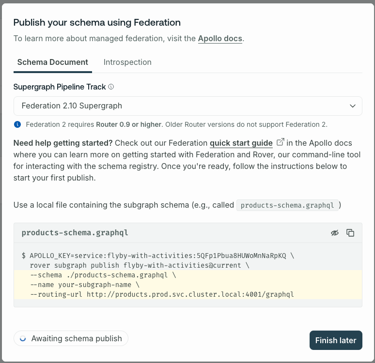
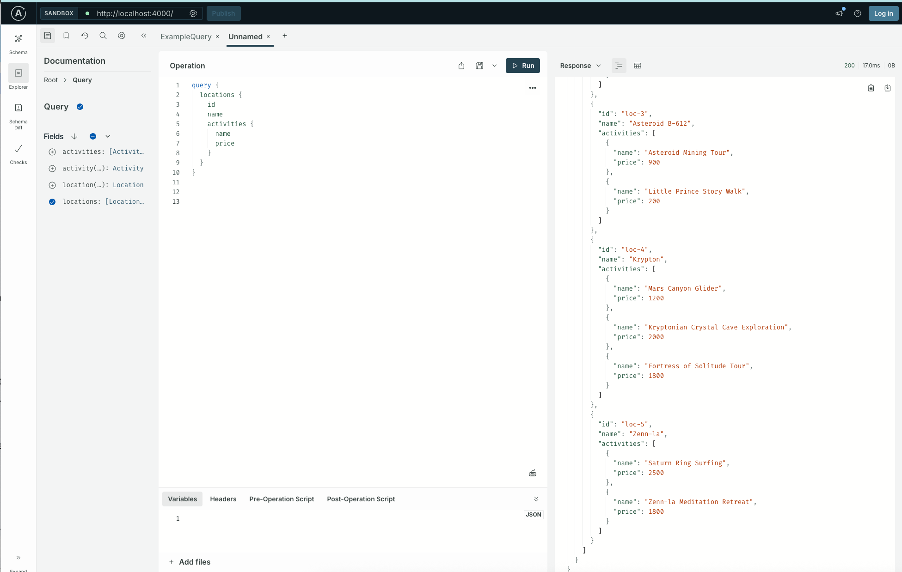

# Locations and Activities - GraphQL Federation Example

This project demonstrates GraphQL Federation with two sub-graphs:

- **Locations subgraph**: Pure GraphQL with resolvers
- **Activities subgraph**: Using GraphQL connectors

# Relationship

Activities are associated with locations through a `locationId` field, similar to the locations-reviews pattern in the
original project.

# Structure

- `subgraph-locations/` - Traditional GraphQL subgraph with resolvers and data sources
- `subgraph-activities/` - Connector-based subgraph that fetches data from a REST API
- `router/` - Apollo Router configuration
- `supergraph-config.yaml` - Federation configuration

# Running the Project

Create a new graph in GraphOS Studio by clicking "Connect existing graph" and entering the graph ID
`flyby-with-activities`.

You should see the following window pop up:


Copy the APOLLO_KEY and the APOLLO_GRAPH_REF (flyby-with-activities@current) and store them in a .env file:

```
export APOLLO_KEY=<your_apollo_key>
export APOLLO_GRAPH_REF=flyby-with-activities@current
```

Source the .env file in your terminal when you want to work with this project using rover:

```bash
source .env
```

Ignore the publish command in the dialog, and run the following commands to publish the schemas of the sub-graphs:

```bash
rover subgraph publish $APOLLO_GRAPH_REF \
  --schema ./subgraph-locations/locations.graphql \
  --name locations \
  --routing-url http://localhost:7778/graphql

rover subgraph publish $APOLLO_GRAPH_REF \
  --schema ./subgraph-activities/activities.graphql \
  --name activities \
  --routing-url http://ignore
```

Whenever you make changes to the sub-graphs, you need to re-run the publish commands to update the schemas in GraphOS
Studio.

You can also just run the publish.sh script to publish both sub-graphs at once, which sources the .env file and runs
these commands:

```bash
./publish.sh
```

We need to run two backend services:

The activity service listens on port 7777

```
python subgraph-activities/activity_service.py &```
```

The locations service listens on port 7778

```
cd subgraph-locations
npm start &
cd -
```

Now, we are ready to launch the composed super graph locally:

```
❯ rover dev --supergraph-config supergraph-config.yaml
merging supergraph schema files
supergraph config loaded successfully
starting a session with the 'activities' subgraph
==> Watching /Users/gigi/git/apollo/odyssey-voyage-I/locations-activities/subgraph-activities/activities.graphql for changes
starting a session with the 'locations' subgraph
==> Watching /Users/gigi/git/apollo/odyssey-voyage-I/locations-activities/subgraph-locations/locations.graphql for changes
composing supergraph with Federation 2.11.0
==> Attempting to start router at http://localhost:4000.
==> Health check exposed at http://127.0.0.1:8088/health
WARN: Connector debugging is enabled, this may expose sensitive information.
==> Your supergraph is running! head to http://localhost:4000 to query your supergraph
```

We can now navigate to our local sandbox and explore the graph with queries stitching the locations and activities
sub-graphs.:



